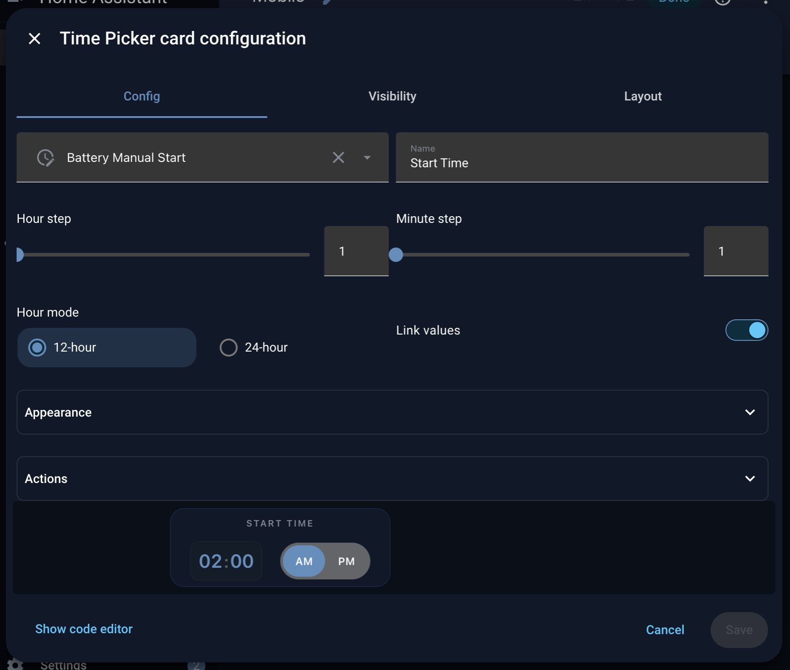
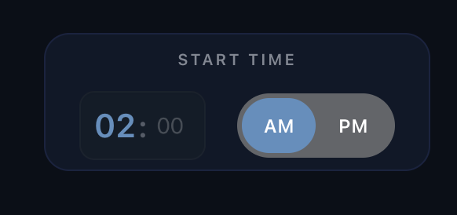
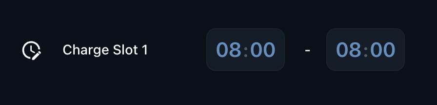
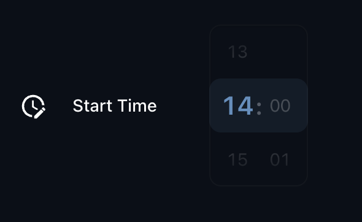

# Time Picker Card

[![HACS][hacs-shield]][hacs-link]
[![Downloads][downloads-shield]][downloads-link]
[![GitHub Release][releases-shield]][releases-link]
[![CI][ci-shield]][ci-link]
[![Project Maintenance][maintenance-shield]][maintenance-link]
[![License][license-shield]][license-link]

## Overview

This is a Time Picker Card for [Home Assistant](https://www.home-assistant.io/)'s [Lovelace UI](https://www.home-assistant.io/lovelace).

Requires an [Input Datetime](https://www.home-assistant.io/integrations/input_datetime/) that has time (`has_time: true`).

**v2** is a ground-up, dependency-free rewrite: no `lit`, no `custom-card-helpers`, no runtime dependencies at all - just a small native Web Component. The old up/down arrow steppers are replaced with fluid, native-momentum scroll wheels for hour/minute/second, plus a sliding AM/PM pill. All existing YAML configuration keeps working unchanged.

## Installation

### HACS

Install using [HACS](https://hacs.xyz) and add the following to your config:

```yaml
resources:
  - url: /hacsfiles/lovelace-time-picker-card/time-picker-card.js
    type: module
```

### Manual

Download `time-picker-card.js` from the [latest release](https://github.com/dwainegallimore/lovelace-time-picker-card/releases/latest) and place it in your `config/www` folder. Add the following to your config:

```yaml
resources:
  - url: /local/time-picker-card.js
    type: module
```

## Usage

### Visual Editor

Time Picker Card supports Lovelace's Visual Editor. Click the + button to add a card and search for time picker.



## Examples

### 12-hour mode with the AM/PM toggle



```yaml
type: custom:time-picker-card
hour_mode: 12
hour_step: 1
layout:
  hour_mode: double
  align_controls: center
  name: header
  embedded: false
  thin: true
hide:
  seconds: true
link_values: true
entity: input_datetime.battery_manual_start
name: Start Time
minute_step: 1
grid_options:
  rows: auto
```

### Idle - collapses to a single row until you interact with it


```yaml
type: custom:time-picker-card
hour_mode: 24
hour_step: 1
layout:
  hour_mode: double
  align_controls: center
  name: inside
  embedded: false
  thin: true
hide:
  seconds: true
link_values: true
entity: input_datetime.battery_manual_start
name: Start Time
minute_step: 1
grid_options:
  rows: auto
  columns: 6
```

### Two cards stacked horizontaly with embedded layout



```yaml
type: horizontal-stack
cards:
  - type: custom:time-picker-card
    hour_mode: 24
    hour_step: 1
    layout:
      hour_mode: double
      align_controls: center
      name: header
      embedded: true
      thin: true
    hide:
      seconds: true
      name: false
      icon: false
    link_values: true
    minute_step: 1
    name: Charge Slot 1
    grid_options:
      rows: auto
      columns: 9
    entity: input_datetime.sample_time
  - type: custom:time-picker-card
    hour_mode: 24
    hour_step: 1
    layout:
      hour_mode: double
      align_controls: left
      name: header
      embedded: true
      thin: true
    hide:
      seconds: true
      name: false
      icon: true
    link_values: true
    minute_step: 1
    name: '-'
    grid_options:
      rows: auto
      columns: 9
    entity: input_datetime.sample_time_end
grid_options:
  columns: 15
  rows: auto
```

### Scroll-wheel interaction



## Options

| Name              | Type         | Requirement  | Description                                                                                               | Default                  |
| ----------------- | ------------ | ------------ | ----------------------------------------------------------------------------------------------------- | ------------------------ |
| type              | string       | **Required** | `custom:time-picker-card`                                                                                 |                          |
| entity            | string       | **Required** | [Input Datetime](https://www.home-assistant.io/integrations/input_datetime/) entity with `has_time: true` |                          |
| name              | string       | **Optional** | Card name                                                                                                 | Entity's `friendly_name` |
| link_values       | boolean      | **Optional** | If enabled, will change hour when minutes overflow. E.g. will go from 11:55 to 12:00, instead of 11:00    | `false`                  |
| hour_mode         | `12` or `24` | **Optional** | Hour format. If `12`, card will show AM/PM picker                                                         | `24`                     |
| hour_step         | number       | **Optional** | Hour change when clicking arrows                                                                          | `1`                      |
| minute_step       | number       | **Optional** | Minute change when clicking arrows                                                                        | `5`                      |
| delay             | number       | **Optional** | Delay in ms before updating entity                                                                        | `0`                      |
| layout            | object       | **Optional** | Card Layout configuration                                                                                 | `none`                   |
| hide              | object       | **Optional** | Hide object                                                                                               | `none`                   |
| tap_action        | action       | **Optional** | Home assistant action to perform on tap                                                                   | `more-info`              |
| double_tap_action | action       | **Optional** | Home assistant action to perform on tap                                                                   | `more-info`              |
| hold_action       | action       | **Optional** | Home assistant action to perform on tap                                                                   | `more-info`              |

### Layout Object

| Name           | Value                     | Requirement  | Description                                                                                        | Default  |
| -------------- | ------------------------- | ------------ | -------------------------------------------------------------------------------------------------- | -------- |
| hour_mode      | `single`, `double`        | **Optional** | Whether to show both AM/PM or just the current mode. In `single` mode, tap the value to change it. | `double` |
| align_controls | `left`, `center`, `right` | **Optional** | Horizontal alignment of the controls                                                               | `center` |
| name           | `header`, `inside`        | **Optional** | Whether to show the name as a header or inside the card                                            | `header` |
| embedded       | boolean                   | **Optional** | Render with embedded style - disables padding, box shadow, and card header                         | `false`  |
| thin           | boolean                   | **Optional** | Render with reduced paddings                                                                       | `false`  |

### Hide Object

| Name    | Type    | Requirement  | Description                                       | Default |
| ------- | ------- | ------------ | ------------------------------------------------- | ------- |
| name    | boolean | **Optional** | Hides the card name                               | `false` |
| icon    | boolean | **Optional** | Hides the card icon (only with controls "inside") | `false` |
| seconds | boolean | **Optional** | Hides seconds input                               | `true`  |

### Theme Variables

Time Picker Card will automatically pick up colors from your lovelace theme, but if you want to customize some of them,
you can use the following variables in your theme's config file:

| Name                                  | Default                        | Description                                                                                          |
| -------------------------------------- | ------------------------------ | ---------------------------------------------------------------------------------------------------- |
| time-picker-elements-background-color | `var(--primary-color)`         | Background color for header and inputs                                                               |
| time-picker-icon-color                | `var(--primary-text-color)`    | Arrow color                                                                                          |
| time-picker-text-color                | `white`                        | Text color                                                                                           |
| time-picker-accent-color              | `var(--primary-color)`         | AM / PM active color                                                                                 |
| time-picker-off-color                 | `var(--disabled-text-color)`   | AM / PM inactive color                                                                               |
| time-picker-border-radius             | `var(--ha-card-border-radius)` | Border radius of the card                                                                            |
| time-picker-control-padding           | `8px`                          | Padding for interactive elements. Increase for larger hitboxes of the controls. Example: `10px 12px` |

## Credits

This is a fork of [GeorgeSG/lovelace-time-picker-card](https://github.com/GeorgeSG/lovelace-time-picker-card) by **Georgi Gardev** ([gar.dev](https://gar.dev)), rewritten as a dependency-free native Web Component with fluid scroll wheels. All credit for the original card and its design goes to Georgi - this fork builds on that foundation.

## Meta

**Dwaine Gallimore**

- [github.com/dwainegallimore](https://github.com/dwainegallimore)

[hacs-shield]: https://img.shields.io/badge/HACS-Default-brightgreen.svg
[hacs-link]: https://github.com/hacs/integration
[downloads-shield]: https://img.shields.io/github/downloads/dwainegallimore/lovelace-time-picker-card/latest/total?color=brightgreen&logo=github
[downloads-link]: https://github.com/dwainegallimore/lovelace-time-picker-card/releases
[releases-shield]: https://img.shields.io/github/release/dwainegallimore/lovelace-time-picker-card.svg
[releases-link]: https://github.com/dwainegallimore/lovelace-time-picker-card/releases
[ci-shield]: https://img.shields.io/github/actions/workflow/status/dwainegallimore/lovelace-time-picker-card/ci.yaml?label=CI&logo=github
[ci-link]: https://github.com/dwainegallimore/lovelace-time-picker-card/actions?query=workflow%3ACI
[maintenance-shield]: https://img.shields.io/maintenance/yes/2026.svg
[maintenance-link]: https://github.com/dwainegallimore/lovelace-time-picker-card
[license-shield]: https://img.shields.io/github/license/dwainegallimore/lovelace-time-picker-card?color=brightgreen
[license-link]: https://github.com/dwainegallimore/lovelace-time-picker-card/blob/master/LICENSE
